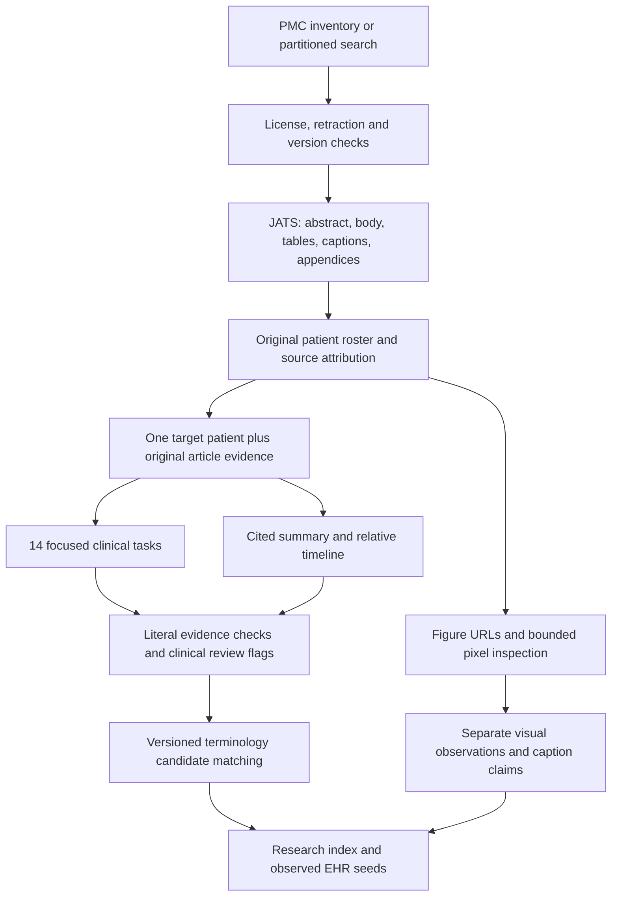

# From licensed PMC articles to patient records

Use **PMC full-text JATS as canonical provenance**, with PubMed as an optional discovery and bibliographic layer. Clinical extraction can additionally read official PMC TXT, or an explicitly selected PDF view with layout review flags; see [source routing and recovery](EXTRACTION_INTEGRATION.md). PubMed abstracts cannot substitute for the full case, tables, figures and follow-up. This implementation reads the current versioned PMC Cloud metadata/XML layout. The old OA-service/bulk layout was retired in August 2026; do not build a new crawler around it. Sources: [PMC AWS documentation](https://pmc.ncbi.nlm.nih.gov/tools/pmcaws/), [OA-service notice](https://pmc.ncbi.nlm.nih.gov/tools/oa-service/).



## Discovery without a case-report blind spot

For maximum recall, enumerate every eligible article from the current PMC inventory, then use article-level model screening. Case-report publication types, case-series terms, patient presentation language and section headings are useful priorities, not mandatory inclusion rules. Original cases can appear in a research article or a review. A cited case in a literature-review table must not become a new original patient. Aggregate trial participants do not automatically constitute extractable individual records.

`article-search` is a bounded ESearch adapter (at most 1,000 IDs/request, 10,000 accessible per query partition), not a whole-PMC enumerator. At scale use the PMC inventory or subdivide by date and license, verify counts, and persist an ID/version discovery ledger. The current code does not implement a distributed inventory scheduler. Keep a sampled low-priority lane to estimate how many cases the prioritization misses; evaluate by article cluster, specialty, species, license and article type.

```bash
uv run op2 article-search --query '2023[pdat]' --limit 100 --output data/candidates.json
uv run op2 article-fetch --input data/candidates.json --output data/articles.jsonl \
  --limit 100 --max-bytes 100000000
uv run op2 article-lengths --input data/articles.jsonl --output data/article-lengths.json
```

Acquisition checks explicit metadata and JATS license statements, including nested URLs and contradictory prose. The pilot caught three such conflicts; they are excluded from corrected exports. Stored approvals are rechecked before inference, indexing and EHR-seed export. CC0, CC BY, CC BY-NC and CC BY-NC-SA enter the noncommercial-compatible collection. CC BY-SA stays in a separate source-terms lane; licenses are not a simple “better/worse” ladder. ND, unknown/conflicting terms and retracted/unknown-retraction records fail the gate. Preserve the exact source license/version, authors, citation, changes and asset-specific exceptions. This is a configured acquisition policy, not an automatic legal determination that every combined release can carry one license. The [Creative Commons license descriptions](https://creativecommons.org/share-your-work/cclicenses/) explain the different conditions.

The parser removes bibliography/author clutter, not discussion sections. It retains every selected block with immutable IDs and hashes. Tables preserve captions, headers, group headings and explicit row/column-span markers. Complex table grids still require review. Supplement manifests keep references, actual matched asset URLs, extensions and a tabular-data hint; contents are not downloaded or assumed known. An unambiguous published version is preferred over a manuscript; multiple eligible published versions require explicit selection.

## Patient identity, species and temporal fidelity

An article roster identifies original patients and assigns source blocks and figure panels. Mixed/shared passages and unresolved attribution remain explicit. Missing block IDs are retained as unresolved rather than discarded. Figure identity cannot be inferred from the person's appearance. The roster includes `species` (human/nonhuman/unknown) and `species_as_documented` (for example, American Pit Bull Terrier). Nonhuman cases remain useful records but are excluded from default human cohort queries.

Article-level deduplication must not merge distinct patients from the same article. Packet deduplication includes the patient identity and roster evidence, while train/test splitting retains the article cluster.

The default clinical packet contains the **whole cleaned article**, with a separate target-patient instruction. This avoids propagating a roster's missed paragraph into every downstream field. `packet_scope: localized` is available, but it trades lower prefill and less background contamination for dependence on localization recall. Neither mode guarantees attribution. Strong source quotes do not prove the quoted statement concerns the target patient; clinical review must score that separately.

Run the 14 focused branches against original evidence. The summary is a companion, never a replacement source. A useful first task warms a patient's prefix before the remaining tasks fan out. A timeline retains literal temporal phrases, event IDs, supported anchors, direction, units and exact/range/approximate/order-only precision. No invented absolute dates or automatic month-to-day conversion. Cycles, nonexistent anchors and unsupported time phrases fail validation. Absence of documentation stays distinct from an explicitly negative finding.

## Output freedom without silent clinical repair

`response_format: prompt_json` sends **no API grammar/schema enforcement**. The model is still asked for a known object structure; the application needs a stable contract. Alternatives are `json_schema`, `json_object`, and `vllm_structured_outputs` where the endpoint supports them. The experiment also supports `generation_style: narrative_then_structure`: generate ordinary prose, then explicitly normalize it in a second model call with access to the original source.

The parser accepts complete JSON, fenced/embedded JSON, safe Python-style object literals, or complete YAML. It records recovery operations. The runners enable audited collapse of identical JSON duplicate values; conflicting duplicates, conflicting objects, executable constructs, truncation and nonfinite values still fail. They also enable segment-local citation formatting recovery and bounded failed-item repair, with accepted neighbors frozen and incomplete results marked partial. See [the precise gates and bounds](EXTRACTION_INTEGRATION.md). Arbitrary prose needs the separate normalization pass; there is no reliable parser that can recover every possible response without sometimes inventing meaning. Clinical fields, quotes and patient identities are validated after syntax recovery. Failed output and each retry remain in the audit trail. Cohere additionally requires `schema_profile: cohere` for schema requests: unsupported wire constraints are omitted explicitly while the full prompt and application checks retain them. This does not weaken stored-data validation. An accepted schema request does not prove that the hosted backend actually enforced every constraint; the pilot labels this the schema-requested arm. See [Cohere’s supported schema subset](https://docs.cohere.com/docs/structured-outputs).

## Images and supplements

All three originally requested models advertised vision support during the pilot; they were tested on actual pixels. The separate image worker also permits a small vision model alongside a text-only extractor. Set `roster_model` to the text model and pass `ehr-seeds --visual-model <vision-model-id>` to combine them explicitly. Without `vision_samples`, the worker enumerates article figures up to `max_images`; it never silently assigns an image to a patient. It fetches at most 8 MB for an image, validates its encoding, sends pixels transiently, and stores URLs/hashes/annotations rather than permanent media copies. JPEG/PNG/GIF/WebP are supported. TIFF/SVG/JP2 need a bounded conversion worker; the current implementation records `conversion_required` instead of pretending it inspected them.

Keep visible observations, author caption statements, patient assignments and uncertainty separate. An unreviewed model reading of an image must not silently overwrite a documented clinical fact. EHR seeds carry both the cited clinical summary and patient-linked image descriptions, plus source URLs for later retrieval. The current text summary is not regenerated after pixel inspection; its adjacent visual section provides those descriptions explicitly. Numeric chart extraction and diagnostic interpretations require review. Asset-level rights exceptions are routed for review independently of the article's license.

```bash
export OPENROUTER_API_KEY='...'  # secret only in environment
uv run op2 article-experiment --config configs/experiments/article-clinical-eligible.yaml
uv run op2 article-vision --config configs/experiments/article-vision-eligible.yaml
uv run op2 ehr-seeds --input runs/article-pilot/clinical-eligible/meta--muse-glimmer-30b/patients.jsonl \
  --visuals runs/article-pilot/vision-eligible/vision-results.json --visual-model google/gemma-4-31b-it --output data/ehr-seeds.jsonl
```

These example experiments reference the small local license-audited pilot and discover their own patient rosters. The older comparative clinical configs used fixed source-checked rosters to isolate downstream extraction; their inputs included three articles later quarantined after the license audit. For new end-to-end discovery, use `configs/experiments/article-workflow.yaml` and `article-workflow-vision.yaml` with `data/articles.jsonl`; neither requires a reference roster. Choose a new experiment output when changing methodology. Resume keys include prompts, schema, model/provider settings and input identity. A shared SQLite ledger reserves cost before requests, retains unknown charges, and caps the pilot at $25 (hard maximum $30). Authentication/access failures block further queued requests to that model. Spark’s age confirmation was completed, but the Contributor endpoint then hit the account’s paid-provider training restriction. Changing that privacy setting is a separate user decision.

## Terminology and downstream EHR construction

No ontologies were downloaded for this pilot. A concrete bounded, opt-in ICD-10-CM download config and licensed-release templates are included:

```bash
uv run op2 vocab-download --config configs/terminology/download-icd10cm.yaml  # dry run
# On the intended storage host, when ready:
uv run op2 vocab-download --config configs/terminology/download-icd10cm.yaml --execute
# Configure catalog releases matching the files actually acquired, then:
uv run op2 vocab-build --config configs/terminology/catalog-icd10cm.yaml --output data/icd10cm.sqlite
uv run op2 code-link --input data/patients.jsonl --output data/patients-coded.jsonl \
  --catalog data/icd10cm.sqlite --config configs/terminology/linking-icd10cm.yaml
```

The downloader verifies optional expected hashes, extracts only explicitly selected members, bounds archive/unpacked bytes and deletes temporary archives. SNOMED/LOINC require the user's authorized release files and license acknowledgement. The existing catalog supports ICD-10-CM, SNOMED CT and LOINC. Automatic exact eligible matches and candidate selection/abstention are separate from clinical extraction; no invented code is accepted. LOINC matching needs specimen/method and other axes, not merely a test name. RxNorm/UCUM mapping is not implemented; medication names, dose and original units remain available for a later extension.

An `ehr-seed` is an **observed published case**, not itself a synthetic patient or FHIR Bundle. It includes stable facts, literal support offsets, relative events, candidate fact/event links, species, images, supplements, licenses, terminology status and review flags. Default export requires all 14 sections plus summary/timeline and a complete roster; `--include-partial` labels incomplete records. Future synthetic compilation should create new identities and dates, preserve origin links, distinguish imputed events, and check compatibility before merging cases. No patient merging, event imputation or FHIR server was added. [Synthetic Hospital review](SYNTHETIC_HOSPITAL_REVIEW.md) explains the useful separation of these stages.

## Scaling on eight B200s

Compare Muse Glimmer and Gemma 4 31B using `configs/serving/muse-glimmer-vllm-{8x1,4x2,2x4,1x8}.yaml` and `configs/serving/gemma4-vllm-{8x1,4x2,2x4,1x8}.yaml`. These generate eight-GPU layouts; they have **not** been run on B200s. Use a pinned model snapshot and a fixed licensed article/packet sample, then test 8 independent TP1 workers, 4×TP2, 2×TP4 and TP8 at matched quality settings. [Google's model card](https://huggingface.co/google/gemma-4-31B-it) and the [vLLM recipe](https://docs.vllm.ai/projects/recipes/en/stable/Google/Gemma4.html) document the architecture/serving prerequisites; they do not measure this workload.

Muse Glimmer uses the versioned [vLLM 0.30 `muse_glimmer` parser](https://docs.vllm.ai/en/v0.30.0/api/vllm/reasoning/muse_glimmer_reasoning_parser/). A [reported upstream performance issue](https://github.com/vllm-project/vllm/issues/54453) concerns its interaction with structured-output decoding. This was not reproduced on our hardware; benchmark plain output plus application validation first, then verify the schema/reasoning combination on the exact engine build.

Measure validated patient records/hour and supported facts/hour alongside input/output tokens, output length, cache-hit fraction, peak memory, time to first token, retry rate and per-domain recall. Hosted API latency mixes provider load, routing, quantization and batching; it cannot decide the optimal B200 topology. More tensor parallelism may reduce single-request latency while replicas improve aggregate throughput. Speculation and quantization are additional experiments after a BF16 baseline, not assumed wins. Keep each patient's branches on the same cache-owning replica.

For a million-article campaign: use CPU discovery/acquisition workers, durable article/version shards, a bounded GPU queue, and CPU validation/coding/export. The article experiment runner is a small/sharded audit harness and keeps its input/results in memory; do not feed it a million-row file. Shards of 100–1,000 articles and explicit storage quotas are a reasonable starting plan, not a measured optimum. The existing clinical `op2 run`/benchmark/Slurm tools accept patient packets. Global corpus deduplication, distributed scheduling, external object storage and population-level quality evaluation still need deployment work. A 12-article pilot (nine passing the final license audit) cannot establish release accuracy or corpus length percentiles.
