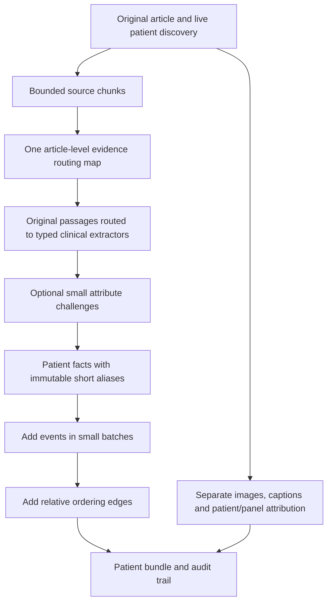

# Source routing and additive patient episodes

This is an opt-in architecture experiment, not a new production default. Launch
the paired pilot with `bash scripts/run_frontier_pilot.sh`; see
[the campaign guide](FRONTIER_PILOT.md) for resource limits and result retrieval.
No clinical improvement is claimed before this campaign is evaluated.

## Why change the architecture?

The previous pipeline repeatedly presented the article to domain extractors and
then asked completion passes to regenerate large patient graphs. In the last
run, timeline completion had 34 pre-call context overflows and only 487/872 valid
calls. A more fluent prompt does not remove that structural problem. The
[last-run review](../reports/BUNDLE_CLINICAL_20261007.md) records the measured
baseline; this experiment changes how evidence and patient state move through
the pipeline.

## Source routing, without replacing the source

Every retained source character enters a map request. Chunks have a 12,000
character target, original segment IDs and offsets; oversized segments overlap
by 300 characters. These are character bounds, not token guarantees. The map
labels quoted propositions by clinical domain and possible patient owner. It is
a routing hypothesis, never a clinical record or a verified summary.

Each domain extractor receives the selected **original passages**, neighboring
blocks and patient identity context. Unknown/shared ownership remains visible
to the relevant patients. Failed map chunks remain available, and a domain with
no matching map entries falls back to the full source. This preserves a recovery
path, but means routing will not always reduce context or inference cost.

The initial patient discovery still reads the full article. Large individual
blocks, full-source fallbacks and discovery can still exceed context. The pilot
must report those failures rather than silently truncate them. A syntactically
valid map can also miss an important proposition; downstream clinical recall is
therefore the deciding metric, not map validity.

## Attribute-specific correction

The optional audit inspects six facts at a time alongside original evidence and
nearby source text. It challenges individual attributes: ownership, laterality,
assertion, dose, unit, timing or another specific scalar. An uncertain verdict
does not authorize a rewrite. Definite challenges trigger one domain
re-extraction against the original source.

Code protects all unchallenged fields, evidence, nulls and duplicate facts using
one-to-one matching. Changing a challenged laterality cannot also change a dose
or erase another observation. Original candidates and model challenges remain
in the audit trail. Literal quotations and valid types do not establish medical
entailment; these reviews remain explicitly model-only.

## Relative episodes instead of whole-graph regeneration

Each patient has a local fact registry: short aliases map to immutable original
fact IDs. Event requests see at most 24 fact aliases, accepted-event context and
the original evidence passages. Later edge requests operate on batches of 16
events. Earlier accepted events and links cannot be overwritten by a later
completion call.

An event needs a source occurrence witness. Edges express supported relative
order or intervals; exact calendar dates are unnecessary. The validator checks
patient ownership, phase-specific operations, delivered fact/event batches,
source visibility, cycles, contradictory order and occurrence anchors. It
distinguishes repeated treatment occurrences rather than identifying an event
by its drug name alone. Unknown order stays unknown; narrative position is not
automatically clinical chronology.

Facts explicitly about another subject are quarantined. Missing subject labels
remain unresolved and require attribution evidence before linking. Unlinked
facts, rejected deltas and quarantined facts remain visible in receipts. These
structural constraints still cannot prove that a quoted sentence entails the
model's proposed event or order. Source review remains necessary.

## The experiment and acceptance criteria

| Arm | Clinical extraction | Timeline |
| --- | --- | --- |
| `live-complete` | Existing patient-section extraction and source audits | Existing completion passes |
| `ledger-delta` | Source map and routed original passages | Additive episodes and edges |
| `ledger-audit` | Same, plus attribute challenges | Same additive builder |

All arms use the same 31 fixed articles, live discovery, seeds 42 and 43, FP8
checkpoint, medium reasoning, DFlash, 64K context and 32K prefill budget. Existing
image/caption and patient/panel evaluation stays enabled. Each worker runs every
arm on its own article subset; ordering is counterbalanced. The comparison tests
an architectural package, not the isolated effect of chunking or timeline
construction. Only `ledger-audit` versus `ledger-delta` isolates the added audit.

Prioritize delivered source-supported clinical probes, forbidden assertions,
relative-order probes, discovery coverage, and paired article-level gains and
losses. Report train/validation/test separately, patient completeness, valid and
invalid calls, context failures, tokens, and generated tokens per GPU-second.
Missing/deferred work remains in the fixed reference denominator. A partial run
is not a complete head-to-head win. Article-bootstrap intervals do not turn the
small development reference into an independent clinical validation cohort.

Strict typed diagnostics supplement the existing bundle score: they preserve
unit case, distinguish negation and planned care, and avoid matching pieces from
different facts. Synthetic adversarial cases test software behavior only; they
are not additional clinically adjudicated gold.

## Where GEPA fits next

This short pilot deliberately does **not** repeat broad GEPA search. It first
tests whether a different computation structure produces useful improvements.
It also emits an objective-adequacy inventory and provides training-only
feedback helpers with missing/forbidden typed fields and executable failure
details. Held-out labels must never enter optimization feedback.

The new routing and attribute-verdict prompts have no direct reviewed labels;
episode ordering currently has only four training articles with 24 ordering
checks and no hard-negative gold. Those are insufficient grounds for claiming
that optimizing every new prompt will generalize. Add reviewed routing
omissions, wrong-owner attributes, repeated-treatment events and ordering
counterexamples before a dedicated search. Evaluate candidate prompts through
their effect on the final patient bundle, not merely whether their JSON parses.

This follows the reflective-feedback principle in the
[GEPA paper](https://arxiv.org/abs/2507.19457) and
[adapter documentation](https://gepa-ai.github.io/gepa/): preserve trajectories
and concrete errors for reflection. GEPA is a search method, not a guarantee
that a proposal improves held-out extraction. Keep the original prompt if a
candidate fails paired confirmation. The existing GEPA package pin and older
campaigns are unchanged.

## Implementation

- [Routing and attribute contracts](../src/openpatients2/evidence_ledger.py)
- [Additive episode state](../src/openpatients2/episode_ledger.py)
- [Pipeline integration](../src/openpatients2/ledger_pipeline.py)
- [Typed and paired evaluation](../src/openpatients2/ledger_evaluation.py)
- [Independent-GPU campaign](../src/openpatients2/frontier_campaign.py)

Local tests validate contracts, provenance, constrained correction, graph
invariants, integration and scheduling. Actual Glimmer quality, memory headroom
and runtime on independent B200 workers remain to be measured on HiPerGator.
