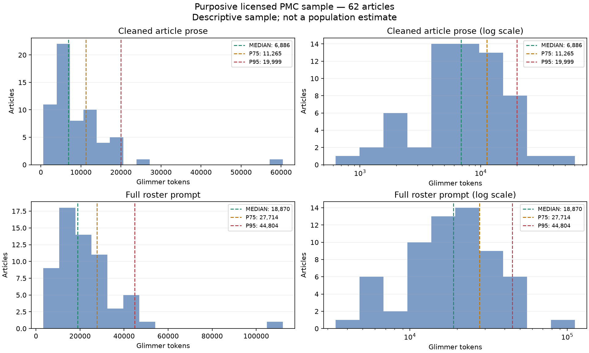

# PMC corpus pilot review — run-20261003-000942

The campaign finished successfully and both source/checkpoint cleanup receipts say `deleted`. The extraction is a useful development result, but it is not a production-quality synthetic EHR corpus yet. Use Red Hat Glimmer FP8, eight TP1 replicas, DFlash, medium reasoning and 65,536-token context as the next baseline. Targeted repair is strongly preferable to direct extraction. The best observed yield used a 32,768-token prefill budget, but this run does not establish that scheduler setting as a medical-quality improvement.

## Scope and archive verification

The CPU study profiled 62 licensed articles and selected 48 for GPU testing. All six recovered task-directory counts exactly match their reports. The archive was initially opened while the transfer was still running; after it reached 8,212,133,483 bytes, a second streaming traversal reached the archive end successfully and recovered the cleanup receipts and all 12 retained images. No container, environment, cache, checkpoint or additional article corpus was extracted locally. Three reviewed images were matched to their recorded SHA256s. Source checking below used immutable article text retained inside requests and patient bundles, not a fresh article download.

## Observed extraction results

“Invalid” in this table includes partial outputs. A task is a section, roster, summary, timeline, or figure operation; it is not one fact or patient. Different successful rosters result in different downstream denominators.

| Context | Prefill | Arm | Patient bundles | Valid / total | Valid % | Generated tokens/s, all 8 GPUs |
| ---: | ---: | --- | ---: | ---: | ---: | ---: |
| 32,768 | 8,192 | Direct | 5 | 65 / 137 | 47.4% | 2,551 |
| 32,768 | 8,192 | Targeted | 16 | 282 / 356 | 79.2% | 6,465 |
| 65,536 | 8,192 | Direct | 10 | 148 / 255 | 58.0% | 5,783 |
| 65,536 | 8,192 | Targeted | 15 | 376 / 458 | 82.1% | 6,476 |
| 65,536 | 32,768 | Direct | 14 | 197 / 334 | 59.0% | 6,330 |
| 65,536 | 32,768 | Targeted | 17 | 419 / 479 | 87.5% | 6,424 |

The last arm includes 45 failed and 15 partial tasks. Clinical sections plus summaries/timelines pass 242/272; the overall count also includes figure work on articles with no extractable patients. Its first-attempt validity was 327/479; repair subsequently delivered 92 additional valid tasks. Targeted repair also makes many more rosters survive, which opens downstream extraction. These are useful gate-yield improvements, not proof of increased medical recall or precision.

Only 1/17 bundles in the last arm passes every scope-completeness gate; another configuration produces 2/15. A “patient bundle” can still lack important sections. The strict field-support audit passes 0/598 fact envelopes in the last arm, largely because it demands literal source words for administrative/normalized enums such as `index_patient`, `present`, and `historical`. That audit does not show 598 false medical facts; it shows that the promotion contract and its evidence builder are not yet aligned. Numeric/dose/time/identity support must remain strict while schema metadata and normalized labels receive appropriate provenance.

The historical fixed-fixture replay passed 168/176 tasks, retained 136/161 required checks in raw outputs and 114/161 in delivered outputs, and triggered 0/36 forbidden checks in available sections. Five forbidden checks were unavailable in delivered sections. This is a partial checklist and neither a full medical accuracy score nor a fair substitute for new-source annotation.

Throughput excludes server startup, queue time and CPU downloads. It includes orchestration and repairs during the arm. The previous ~18.7k tokens/s came from a different, repeated-prompt tuning workload. This run's ~6.4k tokens/s cannot establish a GPU-engine regression. Different patient rosters, output volumes, prefix reuse and per-replica load confound speed comparisons. Arms were run direct before targeted and only one seed was tested. The 6,476 vs 6,424 difference is under 1%; it does not justify another large scheduler search before correctness fixes.

## Article lengths

The broad accepted set contains 35 research articles, 15 reviews, 9 formal case reports, 2 letters and 1 commentary. Licenses are 46 CC BY and 16 CC BY-NC. The absence of CC BY-NC-SA/permissive licenses in this small sample does not establish an exclusion in the filter. Acquisition downloaded 9,384,093 cumulative response bytes, not anywhere near the 150 GB ceiling. The queue is complete for selected candidates, but query discovery is explicitly incomplete because lane quotas were reached.

| Population | n | Words mean / median / P95 | Glimmer prose tokens mean / median / P95 |
| --- | ---: | ---: | ---: |
| Broad accepted sample | 62 | 6,038 / 4,318 / 12,233 | 9,209 / 6,886 / 19,999 |
| Formally tagged case reports | 9 | 1,776 / 1,520 / 2,850 | 2,720 / 1,975 / 5,273 |
| Articles yielding patients in the last arm | 14 | 1,817 / 1,500 / 3,466 | 2,572 / 1,919 / 4,942 |

These are purposive development samples, not population percentiles. The patient-producing subgroup is additionally selected by model/validator survival. Prose includes retained abstract, body, table and caption segments and excludes references. The broader lengths must not replace case-report estimates in production planning without accounting for article mix.

Broad-sample structural packets average 10,009 tokens, while full roster prompts average 22,433; median/P95 roster prompts are 18,871/44,804. With the reserved 16k output and 512-token margin, only 22/62 fit 32k; 60/62 fit 64k. Long cases need a bounded chunking/fallback route, not truncation. Compact segment representation and per-task output budgets should be tested before a blanket 128k allocation.

The tokenizer worker trial changes only from ~13.14 articles/s at one worker to ~13.33 at 32. Identical scalar-count digests are reassuring, but the nearly flat scaling does not demonstrate effective CPU parallelism. Profile rendering/tokenization and repeated work before increasing CPU reservations.

## Source and pixel spot review

This is a targeted inspection, not a randomly sampled accuracy audit.

- **PMC13549756, three infants:** the last arm correctly keeps admission sodium/potassium values with their respective patients: p1 129/7.4, p2 115/6.4, p3 121/6.3 mmol/L. It retains p2's aldosterone `>40,000` comparator and separates later follow-up. However, p2's delivered partial medication section omits documented IV flucloxacillin. Valid facts and a surviving section do not imply complete recall. The general mechanistic figure is correctly attributed as background, not as a patient's measurement.
- **PMC13612135, prostate/colorectal cancer:** PSA 137 ng/mL, CEA 102.6 ng/mL, zoledronic acid monthly and Lu-PSMA 200 mCi every eight weeks are preserved. Planned vs administered radioligand entries are separate. The source/caption itself mentions three treatment cycles in prose versus a scan after two cycles; a future timeline must preserve those distinct contexts rather than silently harmonize them.
- **PMC13618765, idiopathic axillary web syndrome:** acemetacin 60 mg b.i.d., VAS 5 before treatment and 1 after treatment, 170-degree shoulder measurements, and a two-month follow-up are supported by the source. The final timeline is rejected for offsets even when meaningful events are present. One repair candidate also drops the original duration/time entries, illustrating why mechanical repairs should not regenerate the full timeline.
- **PMC13624771, endoscopic procedure:** source age 82, lesion size 20 mm, en-bloc removal and lack of adverse events are supported. This is one of the rare complete bundles, from a brief procedural report rather than a conventional case-report article.
- **PMC13542385, intraoral photograph:** patient ownership, clinical-photography category and broad defect description are supported. Specific permanent/supernumerary tooth labels go beyond what was clearly established by the inspected pixels/caption and should remain uncertain. Detailed descriptions need a claim-level visual audit.
- **PMC13524801, CoMET dashboard:** the raw visual response reads the cardiovascular/respiratory instability axes and several bed scores correctly. Attribution correctly leaves the multi-bed display aggregate, rather than assigning it to the article's single infant. The visual section still fails nonliteral caption evidence. Useful visible information is lost behind a whole-object citation failure.
- **PMC13549756, mechanistic diagram:** the model recognizes the diagram and key electrolyte mechanisms, but details of arrow origin/style and spatial positioning are imperfect. It must not promote a hypothesized mechanism shown in a diagram to a confirmed patient event.

In the last arm, 7/9 attempted pixel descriptions and 8/9 pixel attributions pass structural validation. Six combined figure operations are valid. Only 9/12 prepared figures are attempted because failed rosters prevent some figure tasks. These numbers must not be called pixel accuracy; they also differ in denominator from the other arms.

## Offline timeline experiment

For the 17 timelines in the last arm, four passed. I inspected failed candidates offline and recomputed `start`/`end` only when the existing quote occurred exactly once in its declared segment, its segment hash matched, and the source ID matched. No wording, clinical fact, time interpretation, attribution, hash or edge was changed. Six previously failed timelines then passed the existing structural/source gates: a counterfactual 10/17. Seven remain invalid. Medical entailment remains unreviewed. This experiment supports code-derived offsets and hashes, with strict ambiguity checks, instead of asking the LLM to count characters.

## Recommended next experiment

1. **Fix evidence plumbing first.** Generate offsets/hashes in code from exact citations; isolate ambiguous quotes. Separate clinical-value evidence from schema bookkeeping, normalized enums and patient-registry provenance. Freeze supported items during repair and retry unresolved items separately; a failure should not discard unrelated valid medication/lab facts. Split roster identity discovery from figure attribution so a figure citation cannot block every clinical task.
2. **Use a small, adjudicated fixed benchmark.** Annotate about 20 case-bearing articles across single/multiple patients, tables, difficult timelines and all 12 prepared figures. Freeze the same patient roster/task list across extraction arms. Count supported delivered facts, unsupported assertions, missed required facts, patient mixing, numeric/unit mistakes, planned/performed errors and timeline-edge correctness. Run three seeds with balanced arm order before declaring prefill or repair a quality winner.
3. **Improve patient-source yield.** Prioritize PubMed Case Reports and case-series metadata plus patient-bearing sections; keep a smaller exploration lane for research articles, letters and procedural reports. Do not exclude patients embedded in other types or reuse a general figure as patient evidence. Reuse article-local/citation provenance before considering cross-article patient merging.
4. **Reduce prompt and scheduling overhead after correctness.** Keep compact immutable segments, table headers and figure references. Build patient/domain evidence packets with a shared roster, overlap only where needed, and reconcile through source IDs. Test the whole-source baseline against that approach on the fixed sample. Route long cases explicitly and balance replicas by token cost. Report supported facts/s and complete reviewed patients/hour alongside generated tokens/s.

The next step should be a correctness and evidence-recovery iteration on this same small sample, followed by a controlled benchmark. More downloads and broader GPU tuning can wait until timelines, medication recall and patient/figure ownership have measurable accuracy.

For future transfers, package `extraction`, `profile`, `vision-assets`, logs and small receipt files while excluding `.sif`, environments and UV caches. They inflated this transfer to 7.6 GiB without adding useful extraction evidence.
